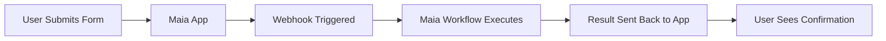

## From Idea to Live Website

Maia can build functional web applications and deploy them instantly — no server setup, no hosting headaches.

<Note>
  Tell Maia what you need, and within minutes you'll have a **live, publicly accessible URL** to share.
</Note>

## What Maia Can Build

<CardGroup cols={2}>
  <Card title="Landing Pages" icon="rocket">
    Product launches, marketing campaigns
  </Card>
  
  <Card title="Dashboards" icon="chart-line">
    Data visualization, analytics, KPI monitoring
  </Card>
  
  <Card title="Internal Tools" icon="toolbox">
    Admin panels, forms, calculators, converters
  </Card>
  
  <Card title="Single Page Apps" icon="window">
    Interactive web applications with complex functionality
  </Card>
  
  <Card title="Portfolios" icon="briefcase">
    Personal sites, project showcases, team pages
  </Card>
  
  <Card title="Prototypes" icon="flask">
    Quick mockups for concept validation
  </Card>
</CardGroup>

## Technology Stack

Maia builds modern, responsive web applications using:

### Frontend Technologies
- **HTML5** - Semantic structure
- **CSS3** - Modern styling and animations
- **JavaScript** - Interactive functionality
- **Responsive Design** - Mobile, tablet, desktop optimization

## Instant Hosting

Every Maia-built website is:

✅ **Automatically hosted** - No server setup required  
✅ **Publicly accessible** - Get a URL immediately  
✅ **HTTPS secured** - SSL certificates included  
✅ **Fast CDN delivery** - Global edge network  
✅ **No maintenance** - Updates and scaling handled automatically  

## Building Process

### Describe Your Vision

<Tabs>
  <Tab title="Simple Request">
    ```
    Create a landing page for my bakery with:
    - Hero section with our photo
    - Menu items with prices
    - Contact form
    - Google Maps embed of our location
    
    Use warm, inviting colors.
    ```
  </Tab>
  
  <Tab title="Detailed Specification">
    ```
    Build a sales dashboard that:
    
    Layout:
    - Top row: 4 KPI cards (Revenue, Deals Closed, Pipeline, Conversion Rate)
    - Middle: Line chart showing monthly revenue trend
    - Bottom: Table of recent deals with columns for 
      Client, Value, Stage, Owner
    
    Data Source: Pull from our CRM API (I'll provide endpoint)
    
    Styling: Corporate blue (#1E3A8A) with dark mode option
    
    Features:
    - Refresh button to reload data
    - Date range filter
    - Export to CSV button
    ```
  </Tab>
  
  <Tab title="Reference-Based">
    ```
    Build something like airbnb.com's homepage but for 
    co-working spaces. Users should be able to:
    - See featured spaces with photos
    - Filter by city and amenities
    - Click to see details
    
    Don't need booking functionality yet, just the browsing 
    experience.
    ```
  </Tab>
</Tabs>

### Design Customization

Maia offers three levels of design control:

<AccordionGroup>
  <Accordion title="Let Maia Design (Easiest)">
    **How it works:**
    ```
    "Create a modern dashboard with a professional look"
    ```
    
    **Result:** Maia chooses colors, fonts, layout based on best practices
    
    **Best for:** Quick prototypes, internal tools, getting started fast
  </Accordion>
  
  <Accordion title="Provide Guidelines">
    **How it works:**
    ```
    Colors: Blue (#1E3A8A) and white
    Font: Sans-serif, clean and modern
    Style: Minimalist with lots of whitespace
    ```
    
    **Result:** Maia designs within your constraints
    
    **Best for:** Branded content, specific aesthetic preferences
  </Accordion>
  
  <Accordion title="Supply Code Snippets">
    **How it works:**
    ```
    "Use this exact CSS for the header:
    
    .header {
      background: linear-gradient(135deg, #667eea 0%, #764ba2 100%);
      padding: 2rem;
      box-shadow: 0 4px 6px rgba(0,0,0,0.1);
    }
    
    And implement this card component: [paste HTML code]"
    ```
    
    **Result:** Maia incorporates your exact code
    
    **Best for:** Developers, precise visual requirements, reusing existing components
  </Accordion>
</AccordionGroup>

## Integration with Maia Workflows

### Apps That Trigger Workflows

Build interfaces that launch your Maia automations:

**Example:**
```
Create a dashboard with a button labeled "Generate Monthly Report"
When clicked, trigger my "Monthly Report" workflow and display 
the PDF when it's ready.
```

**Result:** A simple UI that non-technical team members can use to run complex automations.

{/* ### Webhook-Powered Apps

Connect your app to external triggers:



**Example Use Case:**  
Lead capture form → Triggers workflow to enrich lead data → Adds to CRM → Sends confirmation email

For backend needs, Maia can integrate with existing APIs or you can use Maia's **webhook capabilities** (covered in Deployment section). */}

## Personalized Web Pages at Scale

Maia excels at generating highly personalized, stylized web pages for your customers, leads, or stakeholders. Whether you need custom proposals, personalized reports, or tailored presentations, Maia can:

- **Accept instructions and data** - Provide templates, brand guidelines, and recipient information
- **Gather additional context** - Automatically research and incorporate relevant details
- **Generate at scale** - Create hundreds of unique, personalized pages efficiently
- **Deliver professional results** - Produce polished, shareable pages ready for distribution

Each page can be customized with recipient-specific content, data visualizations, and styling that matches your brand identity — making every interaction feel personal and professional.

See comprehensive examples of building websites, apps, and personalized pages with Maia:

<iframe
  className="w-full aspect-video rounded-xl"
  src="https://www.youtube.com/embed/U_fIKiAF0l4"
  title="YouTube video player"
  allow="accelerometer; autoplay; clipboard-write; encrypted-media; gyroscope; picture-in-picture"
  allowFullScreen
></iframe>

## Limitations

<Warning>
  **What Maia builds:**
  - Frontend web applications
  - Single-page applications (SPAs)
  - Static sites with API integrations
  
  **What Maia doesn't build (yet):**
  - Full backend services (databases, authentication servers)
  - Mobile native apps (iOS, Android)
  - Complex multi-user real-time apps (like Slack clones)
</Warning>

<Card title="Next: Code Execution" icon="code" href="/capabilities/data-analysis">
  Discover how Maia can generate and run code for data analysis, calculations, and visualizations
</Card>
