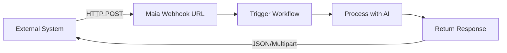

## Event-Driven Automation

Webhooks turn Maia workflows into **intelligent APIs** that respond to external events — form submissions, payment notifications, chat messages, and more.

<Note>
  With webhooks, Maia becomes a **serverless backend** that processes inbound requests with AI-powered logic and returns structured responses.
</Note>

## How Webhooks Work



### Basic Flow

<Steps>
  <Step title="Create Webhook">
    Deploy a workflow with webhook trigger
    
    Maia generates a unique URL:
    ```
    https://hooks.modularmind.app/hooks/0nMMaZgKjmOirqosc8ohkeCuw9cV
    ```
  </Step>
  
  <Step title="External Event">
    Another system sends data to your webhook URL
    
    ```bash
    curl -X POST https://webhooks.maia.app/wh_abc123xyz \
      -H "Content-Type: application/json" \
      -d '{"email": "john@example.com", "message": "Interested in demo"}'
    ```
  </Step>
  
  <Step title="Maia Processes">
    Your workflow receives the payload and executes
    
    - Parse incoming data
    - Run AI analysis, research, or generation
    - Use actions
  </Step>
  
  <Step title="Return Response">
    Maia sends back a result
    
    ```json
    {
      "status": "success",
      "lead_score": 85,
      "recommendation": "High priority - schedule demo ASAP"
    }
    ```
  </Step>
</Steps>

## Creating Webhook-Triggered Workflows

### Simple Example: Lead Enrichment

**Goal:** When a contact form is submitted, enrich the lead data before adding to CRM.

**Workflow:**
```
1. Receive form data (name, email, company)
2. Research company online (industry, size, funding)
3. Check LinkedIn for person's role
4. Calculate lead score (1-100)
5. Add to CRM with enriched data
6. Return lead score and priority
```

**Deployment:**
```
Maia provides webhook URL: https://hooks.modularmind.app/hooks/L3wKjb7iEMFTwMJFZsroWsSoc731
```

**Usage:**
Your website form submits to this URL, and within minutes gets back:
```json
{
  "lead_id": "CRM_12345",
  "score": 92,
  "priority": "hot",
  "reason": "Decision maker at Series B SaaS company"
}
```

## Inbound Payload: Flexible Schema

Unlike traditional APIs that require strict schemas, Maia webhooks are **intelligent**.

### Maia Understands Context

Send any data format, and Maia figures it out:

<Tabs>
  <Tab title="JSON Object">
    ```json
    {
      "customer_email": "jane@example.com",
      "subject": "Need help with billing",
      "message": "I was charged twice this month"
    }
    ```
    
    **Maia extracts:**
    - Email: jane@example.com
    - Subject: Billing issue
    - Problem: Double charge
  </Tab>
  
  <Tab title="Form Data">
    ```
    email=jane@example.com&subject=billing&message=charged+twice
    ```
    
    **Maia converts** to structured format automatically
  </Tab>
  
  <Tab title="File Upload">
    ```
    Content-Type: multipart/form-data
    
    file: invoice.pdf
    description: "Please process this invoice"
    ```
    
    **Maia receives** file, extracts data
  </Tab>
  
  <Tab title="Image Upload">
    ```
    Content-Type: multipart/form-data
    
    file: screenshot.png
    description: "Analyze this image"
    ```
    
    **Maia detects and processes** JPEG/PNG images automatically
  </Tab>
  
  <Tab title="Multiple Files">
    ```
    Content-Type: multipart/form-data
    
    file1: contract.pdf
    file2: receipt.jpg
    file3: notes.txt
    description: "Process all these documents"
    ```
    
    **Maia handles** multiple files in a single request
  </Tab>
  
  <Tab title="Files in JSON">
    ```json
    {
      "invoice": {
        "filename": "invoice.pdf",
        "content": "base64EncodedData...",
        "encoding": "base64"
      },
      "supporting_docs": [
        {
          "filename": "receipt.jpg",
          "data": "binaryData..."
        }
      ]
    }
    ```
    
    **Maia processes** files embedded in JSON (base64 or raw binary)
  </Tab>
  
  <Tab title="ZIP Archive">
    ```
    Content-Type: multipart/form-data
    
    file: documents.zip
    instructions: "Extract and analyze all contents"
    ```
    
    **Maia automatically extracts** ZIP files and processes contents (PDFs, images, text files)
  </Tab>
  
  <Tab title="Complex JSON">
    ```json
    {
      "order_id": "12345",
      "customer": {
        "name": "John Doe",
        "contact": {
          "email": "john@example.com"
        }
      },
      "items": [
        {"product": "Widget", "qty": 5}
      ],
      "attachments": {
        "receipt": "base64Data..."
      }
    }
    ```
    
    **Maia understands** arbitrary nested JSON structures
  </Tab>
</Tabs>

## Outbound Response: Controlling What Gets Returned

When deploying a webhook, you choose how Maia responds to incoming requests.

### Default Response (Immediate)

If you don't enable **"Respond to webhook with data"**, Maia returns immediately with one of these standard responses:

**Success:**
```json
{
  "type": "success",
  "message": "Workflow execution triggered successfully."
}
```

**Error (Invalid Endpoint):**
```json
{
  "type": "error",
  "code": "invalid_endpoint",
  "message": "Invalid endpoint. Please check the path and try again."
}
```

**Error (Disabled Endpoint):**
```json
{
  "type": "error",
  "code": "endpoint_disabled",
  "message": "This endpoint is currently disabled."
}
```

The workflow executes asynchronously, but the caller doesn't wait for results.

### Custom Data Response

Enable **"Respond to webhook with data"** to return workflow outputs back to the caller.

<Frame> </Frame>

When enabled, you define **Body Parameters** — exactly like configuring [Custom Actions](/integrations/custom-actions). This tells Maia what data to include in the response.

#### Supported Response Types

Maia can return:
- **Text data in JSON format** (structured responses)
- **Images** (JPEG, PNG)
- **Text files**
- **PDFs**
- **ZIP files**

Data, including files, can be generated throughout the workflow or downloaded from external sources.

#### Defining Response Parameters

For each parameter you want to return, specify:

**Name**: The field name in the response (e.g., `lead_score`, `generated_image`, `report_pdf`)

**Description**: Natural language explanation of what this field contains and where Maia should get the value from. This helps Maia understand which workflow outputs map to this response field.

**Type**: The type of data (text, file, etc.)

<Note>
  Response parameter definitions work identically to body parameters in [Custom Actions](/integrations/custom-actions#body-parameters). See that section for detailed parameter configuration guidance.
</Note>

#### Example: Lead Scoring Response

**Configuration:**
```
Body Parameters:
- Name: lead_id
  Description: The CRM record ID assigned to this lead

- Name: score
  Description: Calculated lead score from 1-100 based on company research

- Name: priority
  Description: Priority level (hot/warm/cold) based on the score

- Name: next_action
  Description: Recommended follow-up action for the sales team
```

**Returned Response:**
```json
{
  "lead_id": "CRM_54321",
  "score": 88,
  "priority": "hot",
  "next_action": "Schedule demo within 24 hours"
}
```

#### Example: Document Generation Response

**Configuration:**
```
Body Parameters:
- Name: report_pdf
  Description: The generated PDF report file created by the workflow
  Type: File (base64)

- Name: summary
  Description: Brief text summary of the report contents
```

**Returned Response:**
```json
{
  "report_pdf": "base64EncodedPdfData...",
  "summary": "Q4 2025 Sales Report - 23% growth, top performer: Enterprise segment"
}
```

## Real-World Webhook Examples

### Example 1: Intelligent Chatbot Backend

**Setup:** Website chat widget → Maia webhook

**Workflow:**
1. Receive visitor message
2. Search knowledge base using custom action
3. If found: Generate helpful response
4. If not found: Create support ticket via custom action, send notification
5. Return response to chat widget

**Request from caller:**
```json
{
  "visitor_id": "vis_123",
  "message": "What's your refund policy?",
  "page_url": "/pricing"
}
```

**Response to caller:**
```json
{
  "response": "We offer a 30-day money-back guarantee on all 
               plans. If you're not satisfied, contact 
               support@company.com for a full refund.",
  "confidence": 0.92,
  "escalate": false,
  "source": "Help Center: Refund Policy"
}
```

**Result:** Instant, accurate responses powered by AI, with human fallback.

### Example 2: Invoice Processing

**Setup:** Email automation → Maia webhook

**Workflow:**
1. Receive invoice PDF as attachment
2. Extract data (vendor, amount, due date, line items)
3. Validate against purchase order using custom action
4. Add to accounting system via custom action
5. If > $5000, create approval request via custom action
6. Return processing summary

**Request from caller:**
```json
{
  "from": "vendor@supplier.com",
  "subject": "Invoice #12345",
  "attachment_url": "https://storage.../invoice.pdf"
}
```

**Response to caller:**
```json
{
  "status": "processed",
  "invoice_number": "12345",
  "vendor": "ABC Supplier",
  "amount": 3250.00,
  "due_date": "2026-01-15",
  "accounting_id": "INV_789",
  "approval_required": false,
  "line_items": [
    {"description": "Widget A", "quantity": 100, "price": 25.00},
    {"description": "Widget B", "quantity": 50, "price": 15.00}
  ]
}
```

**Result:** Automated invoice processing with data extraction and validation.

### Example 3: Product Review Aggregator

**Setup:** Product review form → Maia webhook

**Workflow:**
1. Receive review text and rating
2. Analyze sentiment (positive/negative/neutral)
3. Extract key themes (quality, pricing, support, etc.)
4. Check for spam/fake reviews
5. If legitimate, publish to website via custom action
6. If mentions bug/issue, create support ticket via custom action
7. Return analysis

**Request from caller:**
```json
{
  "product_id": "prod_456",
  "rating": 4,
  "review": "Great product! Works as advertised. Customer 
             support was responsive when I had a question 
             about setup. Only issue: shipping took longer 
             than expected.",
  "reviewer_email": "customer@example.com"
}
```

**Response to caller:**
```json
{
  "approved": true,
  "spam_score": 0.05,
  "sentiment": "positive",
  "themes": {
    "product_quality": "positive",
    "customer_support": "positive",
    "shipping_speed": "negative"
  },
  "action_items": [
    {
      "type": "feedback",
      "category": "shipping",
      "message": "Customer experienced slow shipping"
    }
  ],
  "published_url": "https://site.com/reviews/rev_123"
}
```

**Result:** Intelligent review moderation with actionable insights.

<Card title="Next: Security & Privacy" icon="shield" href="/security-privacy">
  Learn how Maia protects your data and credentials
</Card>